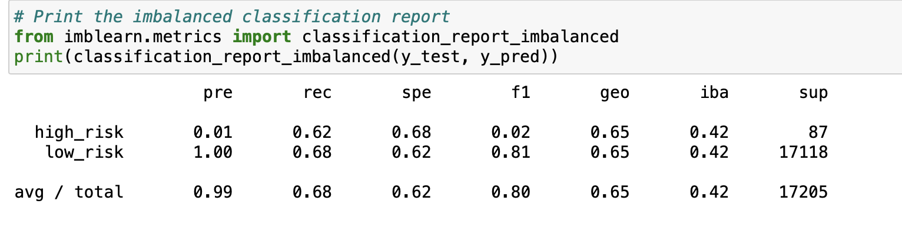
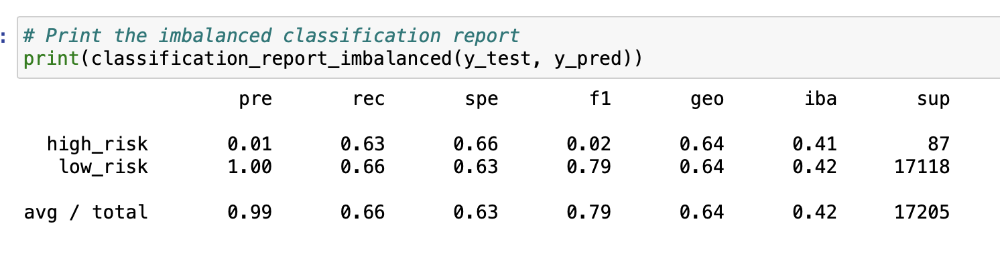
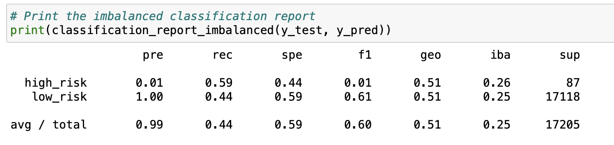
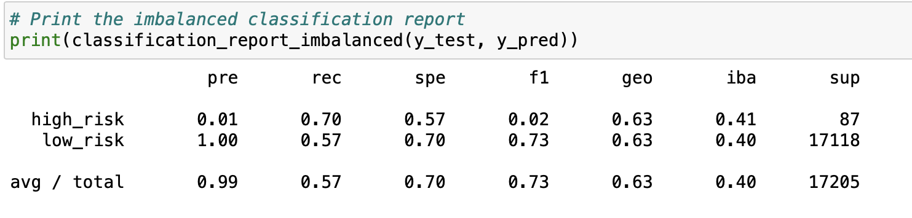
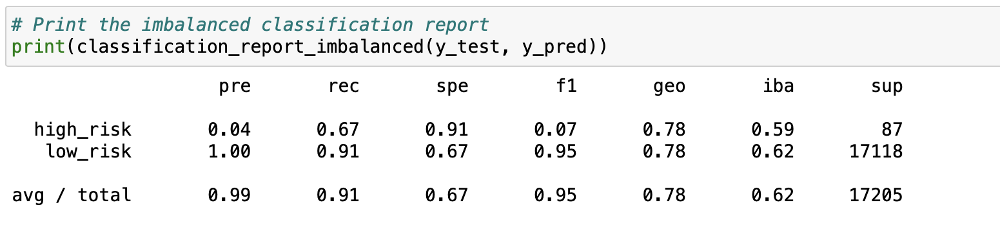
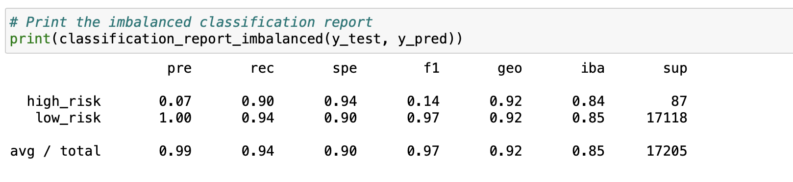

# Credit_Risk_Analysis

## Overview of the analysis.

The purpose of this project is to analyze data from credit loan applicants to see who is a good candidate for a credit loan and who should be rejected. For this, we created machine learning algorithms with different data sampling, until we arrived at the most accurate one. 

## Results.

### Oversampling

- Random Oversampling results:

This method has a 65% accuracy

- SMOTE Oversampling results:

This method has a 64% balanced accuracy

### Undersampling.

- ClusterCentroids resampler results:

This method has a 51% balanced accuracy

### Combination(over and undersampling)

- SMOTEEN results:

This method has a 63% balanced accuracy

### Ensemble Learners

- Balanced Random Forest Classifier results:

This method has a 78% balanced accuracy

- Easy Ensemble AdaBoost Classifier results:

This method has a 91% balanced accuracy

## Summary.

We first undersample and oversample the data, then we did a combination of both. After that, we tried resampling the data and used the Balanced Random Forest Classifier and the Easy Ensemble AdaBoost Classifier. 

After testing all these models and analyzing the results we can conclude that the Easy Ensemble AdaBoost Classifier method is the best way to go.